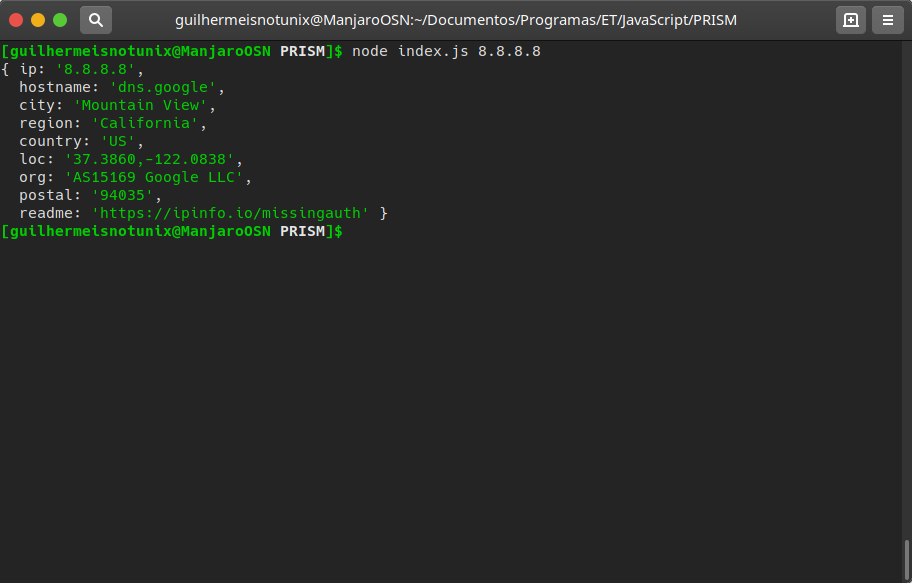

# Prism.js

Prism.js é um programa de rastreamento básico feito em JavaScript, que a partir de um certo IP, mostra informações aproximadas, tais como país, cidade, estado, geo-localização aproximada...

<h2>Responsabilidade</h2>
Não me responsabilizo pelo uso indevido deste código. Prism.js foi criado para fins acadêmicos, principalmente para entender conceitos de Redes de Computadores e APIs.

<h2>Uso</h2>
<b>node index.js &lt;ip&gt;</b>
